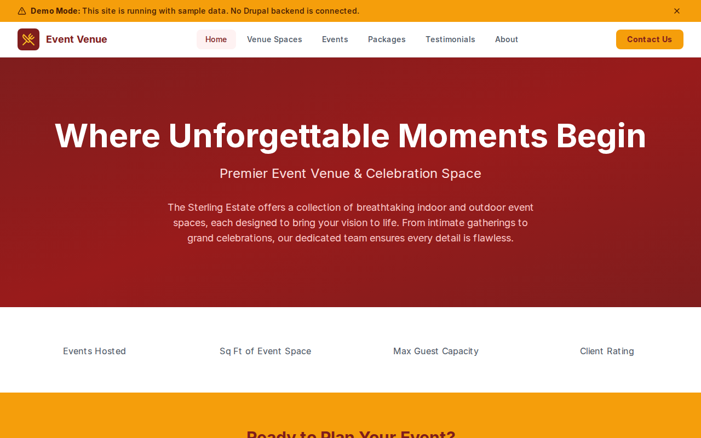

# Decoupled Event Venue

A premier event venue website starter template for Decoupled Drupal + Next.js. Built for event venues, banquet halls, wedding estates, and celebration spaces.



## Features

- **Venue Spaces** - Showcase indoor and outdoor event spaces with capacity, amenities, and pricing
- **Events Calendar** - Promote upcoming galas, concerts, showcases, and private events
- **Event Packages** - Present all-inclusive wedding, corporate, and social celebration packages
- **Client Testimonials** - Display reviews and ratings from past events
- **Modern Design** - Clean, accessible UI optimized for event venue content

## Quick Start

### 1. Clone the template

```bash
npx degit nextagencyio/decoupled-event-venue my-event-venue
cd my-event-venue
npm install
```

### 2. Run interactive setup

```bash
npm run setup
```

This interactive script will:
- Authenticate with Decoupled.io (opens browser)
- Create a new Drupal space
- Wait for provisioning (~90 seconds)
- Configure your `.env.local` file
- Import sample content

### 3. Start development

```bash
npm run dev
```

Visit [http://localhost:3000](http://localhost:3000)

---

## Manual Setup

<details>
<summary>Click to expand manual setup steps</summary>

### Authenticate with Decoupled.io

```bash
npx decoupled-cli@latest auth login
```

### Create a Drupal space

```bash
npx decoupled-cli@latest spaces create "My Event Venue"
```

Note the space ID returned. Wait ~90 seconds for provisioning.

### Configure environment

```bash
npx decoupled-cli@latest spaces env 1234 --write .env.local
```

### Import content

```bash
npm run setup-content
```

This imports:
- Homepage with hero, stats, featured spaces, and CTA
- 4 Venue Spaces (Grand Ballroom, Garden Terrace, Rooftop Lounge, Chapel)
- 3 Upcoming Events (Spring Gala, Jazz Series, Bridal Showcase)
- 3 Event Packages (Wedding, Corporate, Social Celebration)
- 3 Client Testimonials
- 2 Static Pages (About, FAQ)

</details>

## Content Types

### Venue Space
- **capacity**: Maximum guest count
- **square_footage**: Total space in square feet
- **space_type**: Classification (Ballroom, Garden, Rooftop, etc.)
- **amenities**: List of included amenities
- **price_range**: Starting price for the space
- **image**: Featured photo of the space

### Event
- **event_date / end_date**: Event start and end times
- **venue_location**: Which space hosts the event
- **event_category**: Category (Wedding, Corporate, Gala, Concert, etc.)
- **ticket_price**: Admission cost
- **image**: Event promotional image

### Event Package
- **price**: Starting price for the package
- **guest_count**: Maximum guests included
- **duration**: Event duration in hours
- **includes**: List of everything included in the package
- **image**: Package promotional image

### Testimonial
- **client_name**: Name of the reviewing client
- **event_type_name**: Type of event held
- **rating**: Star rating (1-5)
- **event_date_held**: When the event took place

## Customization

### Colors & Branding
Edit `tailwind.config.js` to customize colors, fonts, and spacing.

### Content Structure
Modify `data/event-venue-content.json` to add or change content types and sample content.

### Components
React components are in `app/components/`. Update them to match your design needs.

## Demo Mode

Demo mode allows you to showcase the application without connecting to a Drupal backend.

### Enable Demo Mode

```bash
NEXT_PUBLIC_DEMO_MODE=true
```

### Removing Demo Mode

1. Delete `lib/demo-mode.ts`
2. Delete `data/mock/` directory
3. Delete `app/components/DemoModeBanner.tsx`
4. Remove `DemoModeBanner` from `app/layout.tsx`
5. Remove demo mode checks from `app/api/graphql/route.ts`

## Deployment

### Vercel (Recommended)
[](https://vercel.com/new/clone?repository-url=https://github.com/nextagencyio/decoupled-event-venue)

### Other Platforms
Works with any Node.js hosting platform that supports Next.js.

## Documentation

- [Decoupled.io Docs](https://www.decoupled.io/docs)
- [Next.js Documentation](https://nextjs.org/docs)
- [Drupal GraphQL](https://www.decoupled.io/docs/graphql)

## License

MIT
